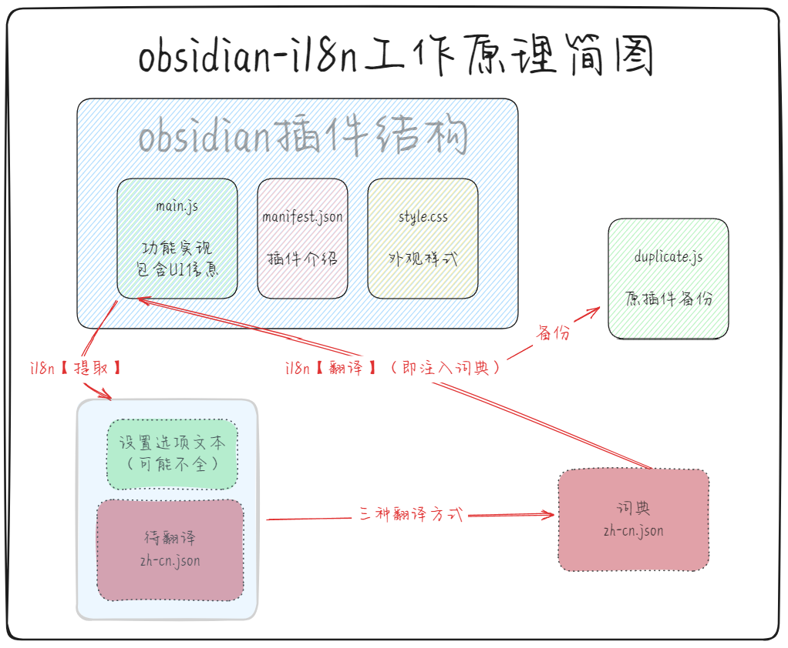
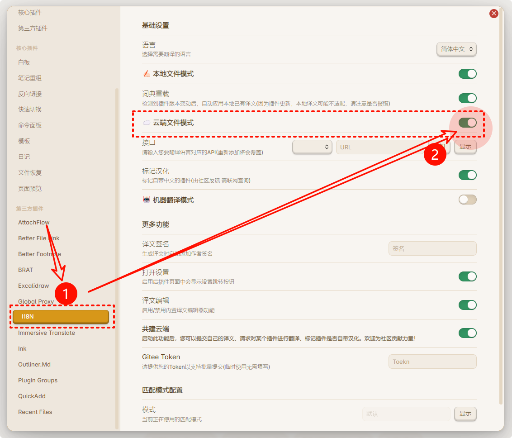
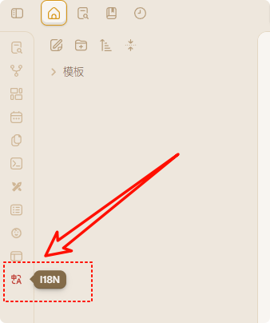
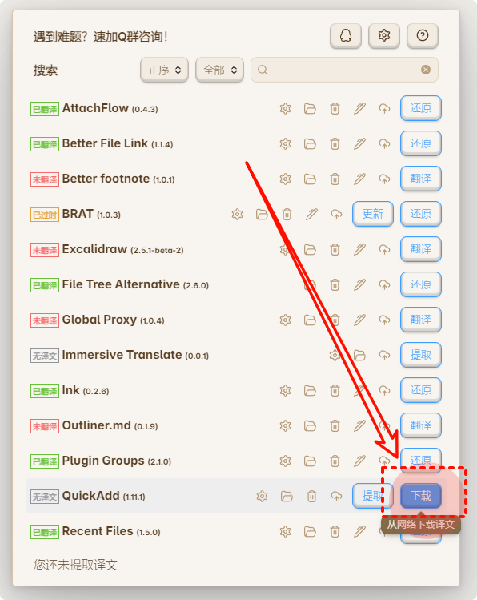
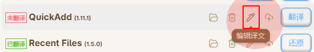
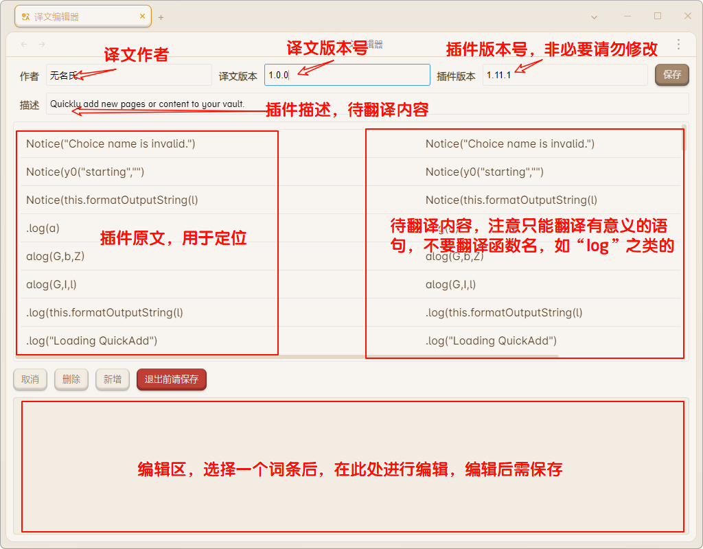

<h1 align="center"> 

  

 Obsidian i18n </h1>

---

[![Contributors][contributors-shield]][contributors-url]
[![Forks][forks-shield]][forks-url]
[![Stargazers][stars-shield]][stars-url]
[![Issues][issues-shield]][issues-url]
[![MIT License][license-shield]][license-url]

obsidian-i18n是用于翻译其他obsidian插件的插件。

obsidian-i18n通过正则匹配其他插件源代码中可能需要被翻译的内容，并输出为词典（待翻译），然后提供三种方式（本地文件模式 、云端文件模式和机器翻译模式）来翻译此词典，然后借助i18n动态的注入与卸载词典。

综上，obsidian-i18n是一个obsidian插件国际化的一站式解决方案。

---

<h1 align="center">⚠️警告⚠️</h1>

<b align="center">您需要知道：插件翻译的工作原理是修改被翻译插件的源文件，i18n会备份修改前的文件，但不排除可能的风险。因此建议您在首次使用前备份您的插件目录（库文件夹/.obsidian/plugins）</b>

# 目录 Table of Contents

- [什么是i18n](#什么是i18n)
- [obsidian的i18n](#obsidian的i18n)
- [obsidian-i18n插件介绍](#obsidian-i18n插件介绍)
	- [敏感权限声明](#敏感权限声明)
  - [快速上手](#快速上手)
    - [安装插件](#安装插件)
      - [brat安装（需要网络能正常连接github）](https://github.com/0011000000110010/obsidian-i18n?tab=readme-ov-file#brat%E5%AE%89%E8%A3%85%E9%9C%80%E8%A6%81%E7%BD%91%E7%BB%9C%E8%83%BD%E6%AD%A3%E5%B8%B8%E8%BF%9E%E6%8E%A5github)
      - [手动安装](#手动安装)
    - [选择适合自己的翻译方式](#选择适合自己的翻译方式)
      - [云端文件模式](https://github.com/0011000000110010/obsidian-i18n?tab=readme-ov-file#%E4%BA%91%E7%AB%AF%E6%96%87%E4%BB%B6%E6%A8%A1%E5%BC%8F%E6%9C%80%E7%9C%81%E5%BF%83%E4%BD%86%E9%80%82%E9%85%8D%E6%95%B0%E9%87%8F%E6%9C%89%E9%99%90)
      - [本地文件模式](https://github.com/0011000000110010/obsidian-i18n?tab=readme-ov-file#%E6%9C%AC%E5%9C%B0%E6%96%87%E4%BB%B6%E6%A8%A1%E5%BC%8F%E8%87%AA%E5%AE%9A%E4%B9%89%E7%A8%8B%E5%BA%A6%E6%9C%80%E9%AB%98)
      - [机器翻译模式](https://github.com/0011000000110010/obsidian-i18n?tab=readme-ov-file#%E6%9C%BA%E5%99%A8%E7%BF%BB%E8%AF%91%E6%A8%A1%E5%BC%8F%E8%BE%85%E5%8A%A9%E7%BF%BB%E8%AF%91%E4%BD%86%E5%8F%AF%E8%83%BD%E5%87%BA%E9%94%99)
  - [常见问题](#常见问题)
  - [进阶设置](#进阶设置)
  - [开源协议](#开源协议)

# 什么是i18n

在信息技术领域，国际化与本地化（英文：internationalization and localization）是指修改软件使之能适应目标市场的语言、地区差异以及技术需要。
基于它们的英文单字长度过长，常被分别简称成i18n（18意味着在“internationalization”这个单字中，i和n之间有18个字母）及L10n。

# obsidian的i18n

目前obsidian官方没有制定i18n的相关规定，导致插件的翻译并没有一个通用的框架。

一般翻译的办法就是直接对插件本体动手，通过定位插件设置页面常用的元素，再找到对应的字符，然后进行其他语言的替换。

本插件本质上也是执行了类似的操作，只是把查找、替换、备份、还原等工作交与插件实现，尽可能降低用户直接操作源代码的行为，减少了被译插件错误的可能。

# obsidian-i18n插件介绍

## 敏感权限声明

### 修改其他插件源代码

- 因为obsidian-i18n的翻译功能实现基于替换其他插件源代码中的文本，因此需要修改其他插件的源代码（会备份原文件）。
- 本插件完全开源，代码可读，如果您担心安全问题，可自行下载编译。

### 使用网络(可选）

- 在线文件模式：从网络下载已翻译的词典
- 机器翻译模式：接入各种api来快速翻译词典
- 内置更新检测：内置了插件更新检测，以提醒用户升级某些重要版本来解决bug

## 快速上手

### 安装插件

因为插件暂时没有上架obsidian插件市场，目前有两种安装办法

#### brat安装（需要网络能正常连接github）
- 在obsidian插件市场安装插件`brat`
- 快捷键 `Ctrl` + `P`，选择命令 `BRAT: Plugins: Add a beta plugin for testing`
- 输入 `https://github.com/0011000000110010/obsidian-i18n`
- 在obsidian设置中确认本插件已启用

#### 手动安装
- 在Github Releases中下载 `main.js`、`manifest.json` 和 `style.css` 三个文件并放入obsidian插件目录下的 `i18n` 文件夹
- 在obsidian设置中确认本插件已启用

### 选择适合自己的翻译方式

obsidian-i18n的工作原理简图：

#### 云端文件模式：最省心，但适配数量有限

本插件提供在线词典库，由作者维护，接受用户上传。

目前已支持obsidian官方插件市场下载量top100的插件，同时词典数量在社区的贡献下不断增加，详见[已翻译插件名单](https://vika.cn/share/shrULbfcRrjrXZVfMA9P4/dstYkrs9t44YXVqf1r/viwriSAj9INh6)

操作指南：
- 在插件设置中启用 `云端文件模式`

  
  
- 点击侧边栏的i18n按钮

  
  
- 选择对应插件右侧的 `下载` 按钮（`下载` 被点击后，会变成 `翻译` ）

  
  
- 点击 `翻译` 按钮
- 正常情况下，翻译已生效
- 如有错误，请点击`还原`按钮，被翻译插件会回到原状态

#### 本地文件模式：自定义程度最高
- 启用 `本地文件模式`
- 点击侧边栏的i18n按钮
- 点击对应插件右侧的 `提取` 按钮
- 点击新出现的钢笔图案，即 `编辑` 按钮

  
  
- 点击后 `编辑` 后会弹出内置编辑器，此编辑器可格式化显示json词典

   
  
- 在编辑器内手动完成翻译后，点击 `翻译` 按钮
- 正常情况下，翻译已生效
- 如有错误，请点击`还原`按钮，被翻译插件会回到原状态

#### 机器翻译模式（辅助翻译，但可能出错）

机器翻译模式本质为本地文件模式的补充，用于减轻翻译的工作量，但是可能会引入以下问题：
- 机器翻译质量低
- 机器翻译无法识别函数/控件/变量等不应该被翻译的内容，因此翻译结果可能无法直接使用

用户在使用机器翻译前应当知晓：如果机器翻译后直接应用词典，可能会出现报错，此时应该手动检查词典内原文与译文的对应情况，**如果发现函数/控件/变量等不应该被翻译的内容被翻译了，请手动修正**。

目前支持百度翻译api与兼容OpenAI格式的大语言模型api。对应接口api的获取方式请自行查询资料。打开机器翻译模式、配置好对应接口后，会出现对应接口的按钮，点击按钮，等待翻译完成后就能得到词典，如果注入词典出错，请插件词典内译文是否有误

##### 百度接口

使用百度机器翻译，需要用户申请百度翻译的APPID与KEY。

##### OpenAI接口

使用兼容OpenAI格式的大语言模型api进行翻译。

选项解释：
- 接口地址：默认为https://api.openai.com ，即ChatGPT官方地址，使用官方key则无需修改。如果使用第三方服务，请参考对应服务商的文档说明。
- KEY：即api key，请参考对应服务商的文档说明。
- 模型：即model，填写你需要使用的模型，注意此处模型名称为api对应的模型名（部分服务商的日常名称与api名称不一样），请查询对应服务商的文档。
- 提示词：即prompt，用于指导AI如何翻译，本插件提供默认提示词，如有需要可自行调整。
- 请求间隔（单位ms）：用于限制请求频率，请查询对应服务商的文档以选择合适频率，如果不知道可以保持默认，默认2次/秒，较慢但一般不会超出限制。

## 常见问题 FAQ

  
Q1：为什么i18n里没有插件/比实际插件数量少？

你的字典格式错误，导致插件无法正确读取。请检查所有插件目录/lang/zh-cn.json，确认json格式是否正常，最简单的办法是删掉所有lang目录。

常见错误是缺少逗号。

  
Q2：为什么点了`翻译`按钮，但是插件依然是原文？

此处的`翻译`指`注入词典`，因此需要词典内存在翻译后的内容，如果提取完直接`翻译`，则不会有任何变化。

  
Q3：为什么注入词典之后，插件无法启动，报错plugin fail to load

用户在使用机器翻译前应当知晓：如果机器翻译后直接应用词典，可能会出现报错，此时应该手动检查词典内原文与译文的对应情况，**如果发现函数/控件/变量等不应该被翻译的内容被翻译了，请手动修正**。

例如原文为：`".createEl(\"h1\", {\n      text: \"Delete the file and its all attachments - logs \"\n    })"`

译文可能被翻译为：`".创造El(\"h1\", {\n      文本: \"删除文件及其所有附件 - 日志\"\n    })",`

但此处的`.createEl`和`text`不应该被翻译。

  
Q4：为什么手机/ipad端用不了？

因为这个插件只能在桌面端使用，它使用了一些移动版不支持的api。你可以在桌面端汉化插件后同步到移动端。

## 进阶设置

详见 [obsidian-i18n Wiki](https://github.com/0011000000110010/obsidian-i18n/wiki)

## 开源协议

本项目采用MIT协议开源。

## 鸣谢

沉浸式翻译功能受到以下两个项目的启发：
- [imfenghuang/obsidian-immersive-translate: Immersive Translate For Obsidian](https://github.com/imfenghuang/obsidian-immersive-translate)
- [xhuajin/obsidian-immersive-translate: Translate plugin setting page.](https://github.com/xhuajin/obsidian-immersive-translate)

从而并引入了[沉浸式翻译的JS SDK](https://immersivetranslate.com/zh-Hans/docs/js-sdk/)

非常感谢imfenghuang、xhuajin 以及沉浸式翻译的开发团队。

<!-- links -->
[your-project-path]:0011000000110010/obsidian-i18n
[contributors-shield]: https://img.shields.io/github/contributors/0011000000110010/obsidian-i18n.svg?style=flat-square
[contributors-url]: https://github.com/0011000000110010/obsidian-i18n/graphs/contributors
[forks-shield]: https://img.shields.io/github/forks/0011000000110010/obsidian-i18n.svg?style=flat-square
[forks-url]: https://github.com/0011000000110010/obsidian-i18n/network/members
[stars-shield]: https://img.shields.io/github/stars/0011000000110010/obsidian-i18n.svg?style=flat-square
[stars-url]: https://github.com/0011000000110010/obsidian-i18n/stargazers
[issues-shield]: https://img.shields.io/github/issues/0011000000110010/obsidian-i18n.svg?style=flat-square
[issues-url]: https://img.shields.io/github/issues/0011000000110010/obsidian-i18n.svg
[license-shield]: https://img.shields.io/github/license/0011000000110010/obsidian-i18n.svg?style=flat-square
[license-url]: https://github.com/0011000000110010/obsidian-i18n/blob/master/LICENSE.txt
[linkedin-shield]: https://img.shields.io/badge/-LinkedIn-black.svg?style=flat-square&logo=linkedin&colorB=555
[linkedin-url]: https://linkedin.com/in/shaojintian

