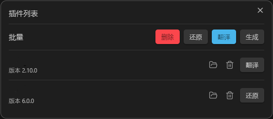
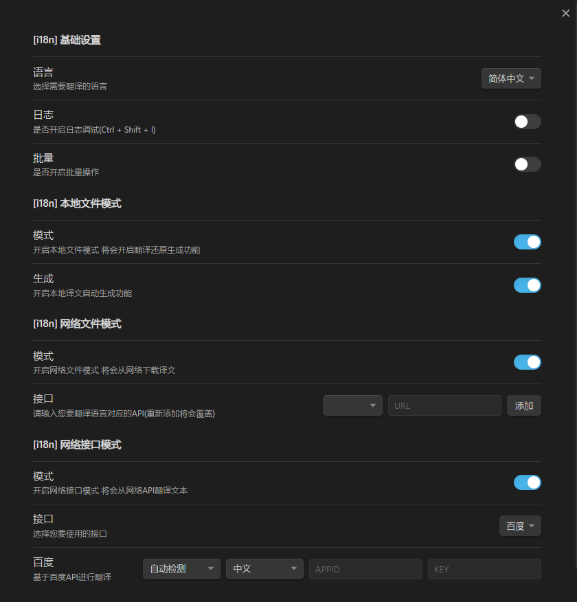

<h1 align="center">Obsidian I18N</h1>

---

Obsidian作为一款强大的笔记应用，拥有丰富的插件生态。为了让这些插件更好地服务于全球用户，提供多语言支持至关重要。通过集成翻译功能，并支持多种翻译模式，可以轻松实现插件内容的本地化。

---

## 功能

### 本地译文模式

- 生成: 一键生成插件的初始未翻译文本，为翻译工作做好准备。
- 翻译: 利用提供的译文对插件进行本地化，让内容更符合您的语言习惯。
- 还原: 轻松将已翻译的插件文本还原至初始状态，方便进行二次修改或重置。

### 网络译文模式

- 下载: 从网络下载插件的已翻译文本，快速实现多语言支持。
- 更新: 自动检测并更新过时的本地网络译文，确保翻译内容始终准确、及时。

### 网络接口模式

- 百度API: 集成百度翻译API，为您提供高质量的机器翻译服务。
- 待更新...

## 截图

## 教程

### 打开

**描述:** 此操作将打开插件目录，允许您查看和管理插件的相关文件和资源。

### 删除

**描述:** 此操作将清空本插件生成的所有内容，包括译文、状态文件和副本文件。如果当前插件已翻译，则会先将其还原至初始状态，然后再进行清空操作。请谨慎使用，以免误删重要数据。

### 生成(未翻译)

**描述:** 为插件生成初始未翻译文本。这将为接下来的翻译工作提供基础。

**教程:** 
1. 配置中打开 本地文件模式 中的“生成”功能。
2. 点击“生成”按钮，插件将自动为您的插件生成初始的未翻译文本文件。
3. 使用插件的“打开插件目录”功能 或 在文件系统中找到您的插件安装目录。
4. 导航至 `插件目录\lang\`，找到与您配置的目标语言相对应的.json文件。（例如，对于中文，文件可能是zh-cn.json）
5. 使用文本编辑器（如Notepad++、VSCode等）打开该文件，开始逐条翻译其中的内容。

### 翻译

**描述:** 利用提供的译文对插件进行本地化，让内容更符合您的语言习惯。

**教程:** 无。

### 还原

**描述:** 轻松将已翻译的插件文本还原至初始状态，方便进行二次修改或重置。

**教程:** 无。

### 下载

**描述:** 从网络下载插件的已翻译文本，快速实现多语言支持。

**教程:** 

1. 配置网络文件模式中的接口。(可使用自己的文件存储地址 [目录格式参考](https://github.com/0011000000110010/obsidian-i18n/tree/main/lang/zh-cn))
2. 如果网络中存在适用于您当前插件且本地尚未配置该语言翻译的文本，将显示“下载”按钮。

### 更新

**描述:**  自动检测并更新过时的本地网络译文，确保翻译内容始终准确、及时。

**教程:** 
1. 配置网络文件模式中的接口地址。
2. 如果网络中存在与您当前插件匹配的翻译文本，并且该文本的版本号与您本地安装的版本不同，将显示“更新”按钮。

### 生成(已翻译)

**描述:** 通过集成第三方翻译服务（如百度翻译API），实现插件内容的自动翻译。这种方法可以大大简化翻译过程，同时确保翻译的准确性和一致性

**教程:** 
1. 配置第三方翻译服务(暂时只支持百度翻译)。
2. 点击“生成”按钮，插件将调用对应翻译API进行自动翻译。

**百度API** 
- 访问百度翻译API官网: [https://fanyi-api.baidu.com/](https://fanyi-api.baidu.com/)
- 注册并登录账号，按照官网指引申请通用文本翻译服务。
- 完成申请后，在控制台中找到“开发者信息”，并获取您的APP ID和密钥。

## 配置

如果您在阅读配置描述时，发现其中有任何不准确或不当的信息，我们非常欢迎您通过Obsidian社区论坛、Github，或是插件支持页面与我们取得联系。您的反馈对我们至关重要，我们将会尽快核实并进行必要的更正，以确保信息的准确性和完整性。感谢您的参与和支持！

## Disclosures

**网络使用**

1. 百度翻译API: 通过调用百度API对插件部分内容进行国际化
2. 外部译文储存库(可选): 从网络中下载别人或自己的已翻译译文

**访问外部文件**

1. 会在需要翻译的插件目录下生成一个lang文件夹用来存储译文文件
2. 会在lang文件夹下生成state.json文件，用来保存译文状态
3. 下载或者生成的译文文件将会被保存到lang文件夹下
4. 将会根据译文文件对插件本身需要国际化的地方进行替换(并对插件本身进行备份可还原)

## PS

- 如果不经过翻译而直接使用未翻译的译文，可能会引发插件功能失效的问题。如出现异常，我们建议您使用插件自带的删除功能来移除错误的译文或者重新下载并安装插件以获取最新的翻译内容。
- 请确保输入正确的API密钥和配置信息，以便插件能够正常工作。
- 根据实际情况选择合适的翻译模式和接口，以获得最佳的翻译效果。
- 由于本人是初学者，边查资料边编写此教程，因此可能存在一些未知的BUG。建议在正式使用前进行充分的测试。

---

通过遵循上述教程和配置指南，您将能够轻松使用Obsidian I18N插件进行插件翻译工作，让您的Obsidian体验更加顺畅和愉快！如有任何疑问或建议，请随时联系我们。
