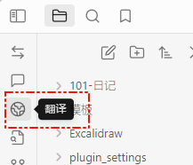
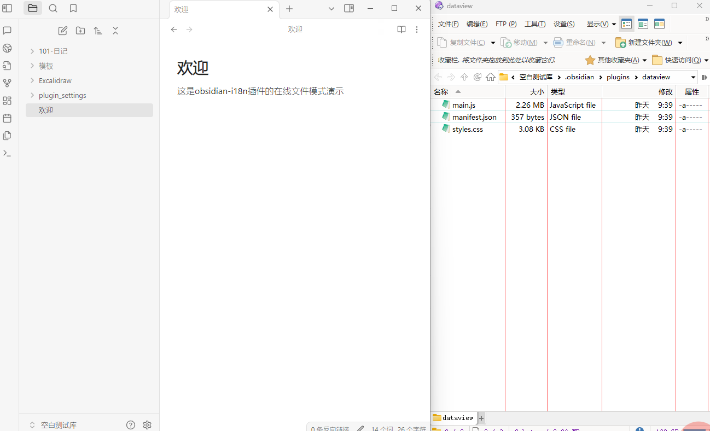
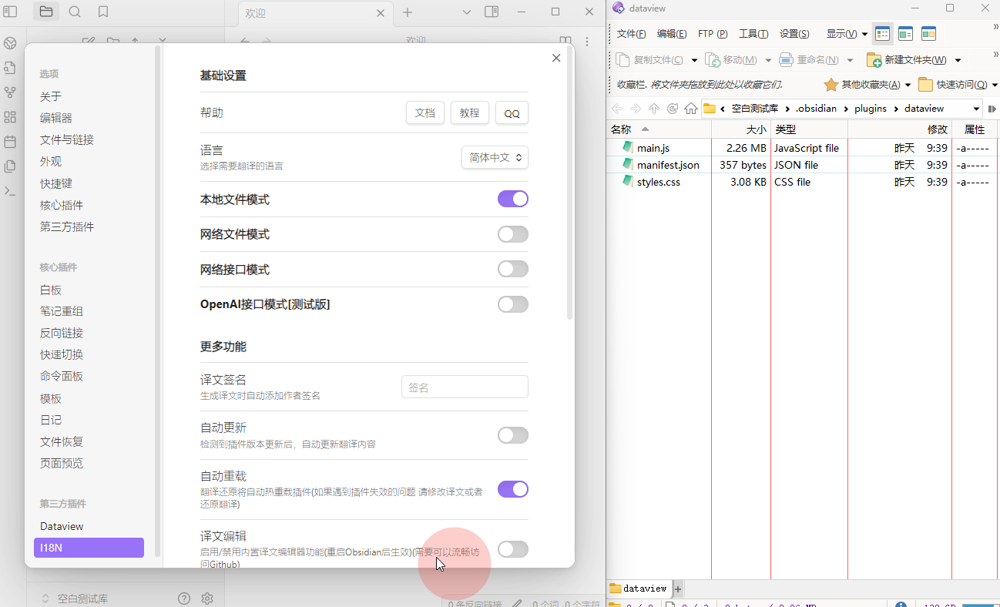

<h1 align="center">Obsidian i18n</h1>

---

obsidian-i18n是用于翻译其他obsidian插件的插件。

obsidian-i18n通过读取其他插件内文本并输出为词典（待翻译），然后提供三种方式（本地自行翻译、利用在线工具翻译和下载网络分享的词典）来翻译此词典。并且提供了词典的加载与卸载功能，确保出现任何问题时，您可以切换回原始版本。

综上，obsidian-i18n是一个obsidian插件翻译的一站式解决方案。

---
# 大纲

- [什么是i18n](#什么是i18n)
- [obsidian的i18n](#obsidian的i18n)
- [obsidian-i18n插件介绍](#obsidian-i18n插件介绍)
	- [敏感权限声明](#敏感权限声明)
	  - [修改其他插件文件](#修改其他插件文件)
    - [使用网络(可选)](https://github.com/dangehub/obsidian-i18n/edit/main/README.md#%E4%BD%BF%E7%94%A8%E7%BD%91%E7%BB%9C%E5%8F%AF%E9%80%89)
  - [快速上手](#快速上手)
    - [安装插件](#安装插件)
      - [brat安装（需要网络能正常连接github）](https://github.com/dangehub/obsidian-i18n/edit/main/README.md#brat%E5%AE%89%E8%A3%85%E9%9C%80%E8%A6%81%E7%BD%91%E7%BB%9C%E8%83%BD%E6%AD%A3%E5%B8%B8%E8%BF%9E%E6%8E%A5github)
      - [手动安装](#手动安装)
    - [选择适合自己的翻译方式](#选择适合自己的翻译方式)
      - [网络文件模式：最省心，但适配数量有限](https://github.com/dangehub/obsidian-i18n/edit/main/README.md#%E7%BD%91%E7%BB%9C%E6%96%87%E4%BB%B6%E6%A8%A1%E5%BC%8F%E6%9C%80%E7%9C%81%E5%BF%83%E4%BD%86%E9%80%82%E9%85%8D%E6%95%B0%E9%87%8F%E6%9C%89%E9%99%90)
      - [本地文件模式：自定义程度最高](https://github.com/dangehub/obsidian-i18n/edit/main/README.md#%E6%9C%AC%E5%9C%B0%E6%96%87%E4%BB%B6%E6%A8%A1%E5%BC%8F%E8%87%AA%E5%AE%9A%E4%B9%89%E7%A8%8B%E5%BA%A6%E6%9C%80%E9%AB%98)
      - [网络接口模式](#网络接口模式)
      - [OpenAI接口模式](https://github.com/dangehub/obsidian-i18n/edit/main/README.md#openai%E6%8E%A5%E5%8F%A3%E6%A8%A1%E5%BC%8F)

# 什么是i18n

在信息技术领域，国际化与本地化（英文：internationalization and localization）是指修改软件使之能适应目标市场的语言、地区差异以及技术需要。
基于它们的英文单字长度过长，常被分别简称成i18n（18意味着在“internationalization”这个单字中，i和n之间有18个字母）及L10n。使用大写的L以利区分i18n中的i和易于分辨小写l与1。

# obsidian的i18n

目前obsidian官方没有制定i18n的相关规定，导致插件的翻译并没有一个通用的框架。
一般翻译的办法就是直接对插件本体动手，通过定位插件设置页面常用的函数，再找到对应的字符，然后进行其他语言的替换。

# obsidian-i18n插件介绍

## 敏感权限声明

### 修改其他插件文件

- 因为obsidian-i18n的翻译功能实现基于替换其他插件内的文本，因此需要修改其他插件的文件（会备份原文件）。

### 使用网络(可选)

- 翻译api：obsidian-i18n提供api功能来在线翻译词典
- 在线词典储存库：从网络下载已翻译的词典

## 快速上手

### 安装插件

因为插件暂时没有上架obsidian插件市场，目前有两种安装办法

#### brat安装（需要网络能正常连接github）
- 在obsidian插件市场安装插件`brat`
- 快捷键 `Ctrl` + `P`，选择命令 `BRAT: Plugins: Add a beta plugin for testing`
- 输入 `https://github.com/0011000000110010/obsidian-i18n`
- 在obsidian设置中确认本插件已启用

#### 手动安装
- 在Github Releases中下载 `main.js`、`manifest.json` 和 `style.css` 三个文件并放入obsidian插件目录下的 `i18n` 文件夹
- 在obsidian设置中确认本插件已启用

### 选择适合自己的翻译方式

obsidian-i18n的工作原理：

#### 网络文件模式：最省心，但适配数量有限
本插件提供在线词典库，由作者维护，接受用户上传。
目前支持的插件有：
{用折叠列表}

操作指南：
- 启用 `网络文件模式`
- 点击侧边栏的i18n按钮
- 选择对应插件右侧的 `下载` 按钮
- 点击 `翻译`
- 正常情况下，翻译已生效

#### 本地文件模式：自定义程度最高
- 启用 `本地文件模式`
- 点击侧边栏的i18n按钮
- 选择对应插件右侧的 `生成` 按钮
- 点击文件夹图标，可以看到对应插件的目录
- 其中 `lang` 为翻译目录，下面会有两个文件 `state.json` 用于记录插件运行状态，一般用户不必关心，另一个文件 `zh-cn.json` 则是词典，用户需要对词典中的值进行翻译（后续会详细介绍如何翻译）。
- 对 `zh-cn.json` 翻译后，点击 `翻译` 按钮，就会用翻译后的词典去替换目标插件的源文件
- 正常情况下，翻译已生效

#### 网络接口模式

使用百度机器翻译，需要用户申请百度翻译的APPID与KEY，此功能可以看作是本地文件模式的子功能。

#### OpenAI接口模式

使用兼容OpenAI的api进行大语言模型AI翻译，与网络接口模式本质相同，均为减轻人工本地翻译的工作量。

选项解释：
- 接口地址：默认为[https://api.openai.com](https://api.openai.com)，即ChatGPT官方地址，使用官方key则无需修改。如果使用第三方服务，请参考对应服务商的文档说明。
- KEY：即api key，请参考对应服务商的文档说明。
- 模型：即model，填写你需要使用的模型，注意此处模型名称为api对应的模型名（部分服务商的日常名称与api名称不一样），请查询对应服务商的文档。
- 提示词：即prompt，用于指导AI如何翻译，本插件提供默认提示词，如有需要可自行调整。
- 请求间隔（秒）：用于限制

## 进阶设置详解

待完善

## 开源协议

待完善

## 贡献说明

待完善

## 替代方案

待完善

## 赞助支持

待完善
